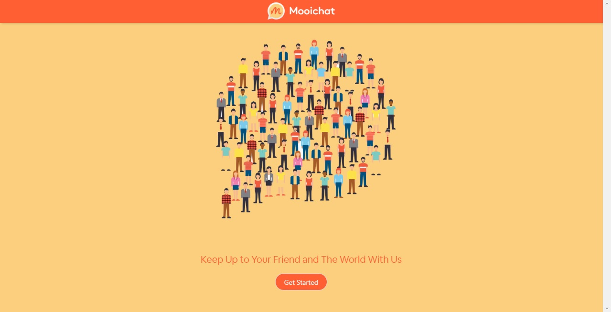
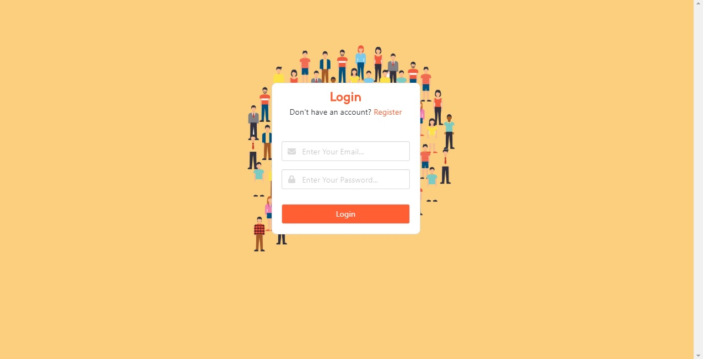
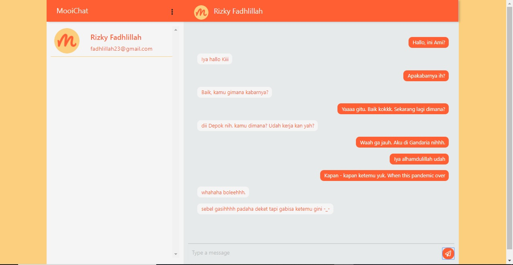
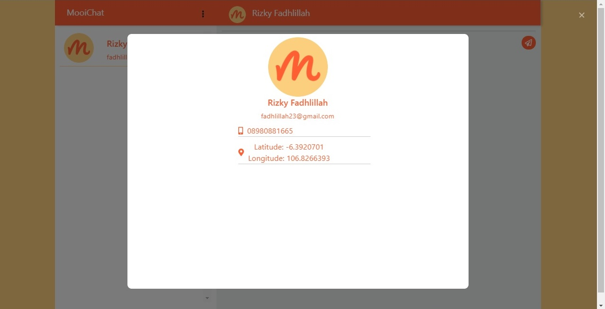
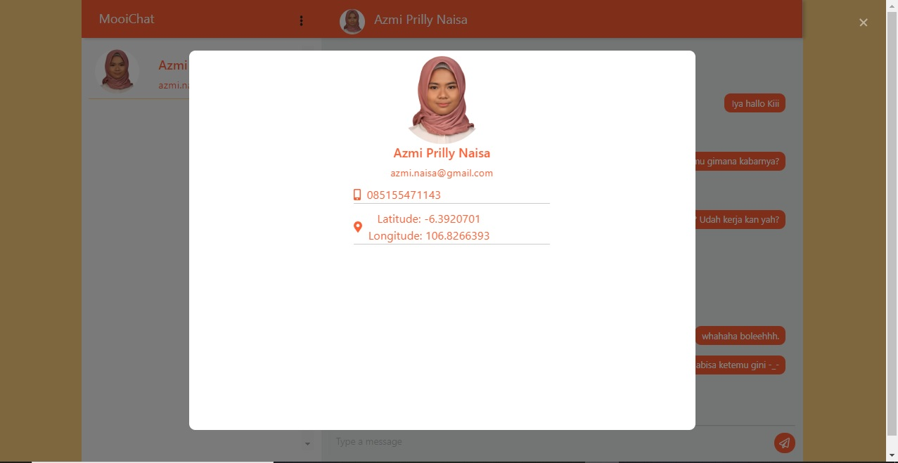

<h1 align="center">Mooichat</h1>


<p align="center">
  &nbsp;
</p>
<p align="center">
  Built with Vue Js. and Firebase
</p>

## Table of Contents

- [Features](#features)
- [Prerequiste](#prerequiste)
- [Installation](#installation)
- [Screenshots](#screenshots)
- [Contact] (#contact)

## Features

- Users who are not logged in can only view the product
- Users must sign up and sign in to make a transaction and see their profiles
- And others

## Prerequiste

- Node.js - Download and Install [Node.js](https://nodejs.org/en/).
- Vue.js - Download and Install [Vue.js](https://vuejs.org/v2/guide/)

## Installation
### Clone
```
$ git clone https://github.com/azmprllynsa/mooichat.git
$ cd mooichat
$ npm install
```
### Create Environment Variable
```
# Set API KEY
VUE_APP_API=YOUR_HOST_URL
VUE_APP_SECRET_KEY_TOKEN=YOUR_SECRET_KEY
```
### Start Development Server
```
$ npm run serve
```

## Screenshots

<div align="center">
    
</div>
<div align="center">
       
</div>
<div align="center">
       
    
    

</div>

## Contact
You can contact me via:
- [Instagram](https://instagram.com/azmprllynsa)
- [Email](azmi.naisa@gmail.com)

---
Copyright © 2020 [Azmi Prilly Naisa](https://github.com/azmprllynsa/)
